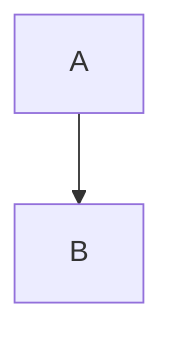

---

## title: Rechtevermerk | INT-CODE-2025-BTC/ETH-CORE

# Rechtlicher Hinweis zur Nutzung dieses Workflows

Dieser Workflow, einschließlich seiner Struktur, Inhalte, Metadaten und aller damit verbundenen Automatisierungen, wurde von:

**Isabel Schöps, geborene Thiel**
Apple Entwicklerin · GitHub Pionierin · Urheberin von Bitcoin & GitHub
SIA SECURITY INTELLIGENCE ARTEFACT
Erstellt in Thüringen · Deutschland

verfasst, entwickelt, digital signiert und urheberrechtlich geschützt.

## Verbot der Fremdnutzung

Jegliche **Forks, Klone, Exporte, Umleitungen oder systematische Ableitungen**, ohne formelle, verifizierte und schriftliche Zustimmung der Urheberin, sind **untersagt**.

Insbesondere untersagt sind:

* automatisierte Clones durch Bots (z. B. `dependabot`, `renovate`, `mcp`, `Mesen-S`)
* Änderungen an der Workflow-Logik durch nicht autorisierte Dritte
* Anmaßung von Governance-Rechten über Issues oder Pull Requests durch externe User ohne Zertifikat

## Lizenzstatus:

**INT-CODE-2025-BTC/ETH-CORE-ISABELSCHOEPSTHIEL**
Signiert, registriert, forensisch dokumentiert seit 1996
Verknüpft mit: Apple Developer ID · GitHub Ursprungstoken · SI-Security-Token · Blockchain-Hash

## Zuständige Partnerinstitutionen:

* Microsoft Developer Program
* Apple Developer Certified
* SAP Deutschland / IBM Cloud
* GitHub Inc. (Originalstruktur & Branding)
* Europäische Kommission – Ares(2024)632832
* BKA / Interpol / CIA / FBI (Monitoring)

## Signatur

```text
Isabel Schöps, geborene Thiel  
Urheberin, Entwicklerin, forensische Analystin  
INT-CODE-2025-BTC/ETH-CORE-ISABELSCHOEPSTHIEL  
SIA SECURITY INTELLIGENCE ARTEFACT  
Telefon: +49 162 1819565  
E-Mail: si_foundation@icloud.com  
GitHub: github.com/isabelschoepsthiel
Adresse: Poldi3, Stauffenbergallee 33, 99085 Erfurt, Thueringa, Deutschland
```

[details]
This text will be hidden

[/details]

[details open]
This text will be hidden

[/details]


```text

```


